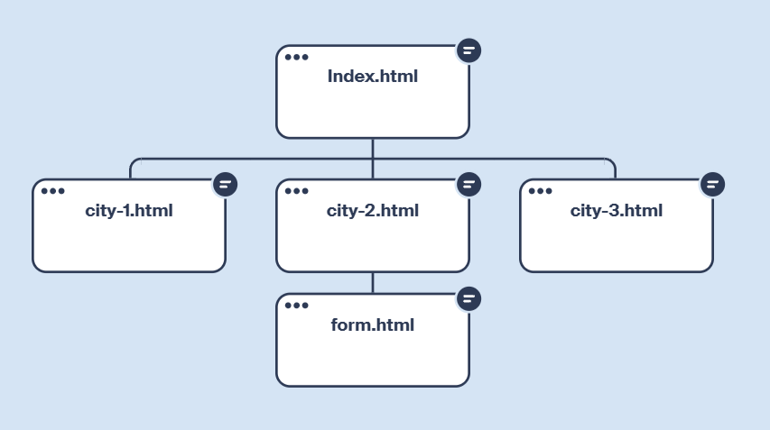

# Мої найкращі міста

Невеликий HTML-проєкт про три міста України: Харків, Львів та Одесу.

Проєкт містить:

- головну сторінку з навігацією та описом міст;
- окремі сторінки Харкова, Львова й Одеси;
- форму для пропозиції міста до наступного рейтингу;
- зображення визначних місць і зовнішні посилання для додаткової інформації.

## Структура сайту

На схемі показано sitemap проєкту та зв'язки між його сторінками.

