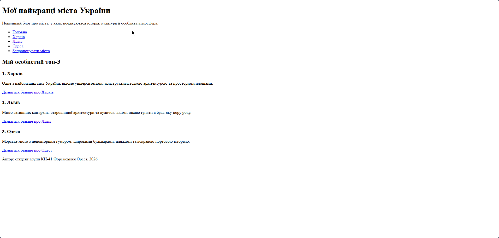

# Звіт до лабораторної роботи №1

## Тема: Імплементація статичного web-блогу «Мої 3 найкращі міста світу» з використанням семантичної HTML-розмітки, організація проєкту в Git-репозиторії, розміщення його на GitHub та розгортання за допомогою GitHub Pages.

## Мета роботи:

Набути практичних навичок проєктування та реалізації багатосторінкового статичного web-сайту, його версіювання та публікації в мережі Інтернет; закріпити вміння створювати семантичну розмітку HTML5, організовувати зв'язки між файлами й навігацію за відносними URL, підключати медіаресурси, розробляти HTML-форми та виконувати deployment на сервісі GitHub Pages.

## Виконання роботи

* створено файлову структуру багатосторінкового проєкту: головну сторінку (`index.html`), три тематичні сторінки міст (`city-1.html`, `city-2.html`, `city-3.html`), сторінку зворотного зв'язку (`form.html`), директорію для графічних ресурсів `images/` та файл документації `README.md`;
* використано семантичні теги HTML5 (`<header>`, `<nav>`, `<main>`, `<section>`, `<article>`, `<footer>`), логічну ієрархію заголовків (`<h1>`–`<h3>`), марковані й нумеровані списки, а також систему контролю версій Git для відстеження змін у коді;
* реалізовано наскрізну систему переходів між сторінками за допомогою коректних відносних URL, зовнішні посилання на довідкові ресурси, а також HTML-форму «Запропонувати місто для наступного рейтингу» з елементами `<label>`, `<input>`, `<select>`, `<option>`, `<textarea>`, `<button>` та атрибутами валідації `required`;
* додано оптимізовані зображення міст із інформативними описами в атрибутах `alt`, ініціалізовано локальний Git-репозиторій, здійснено синхронізацію з віддаленим репозиторієм на GitHub та налаштовано автоматичне розгортання сайту через GitHub Pages із гілки `main`.

## Результат

Посилання на опубліковану сторінку: 
https://orestforemskyi.github.io/Web-Development-KN-41/Lab_1/my-best-cities/index.html
---
Скріншот результату:

## Висновок

Під час виконання лабораторної роботи було опановано принципи побудови багатосторінкового сайту на основі семантичної розмітки HTML5, налаштування навігації через відносні посилання та розробки валідних форм введення даних. Закріплено практичні навички командної роботи з Git (команди `init`, `add`, `commit`, `push`), підключення віддаленого репозиторію на платформі GitHub та публікації статичного сайту у відкритий доступ за допомогою GitHub Pages.