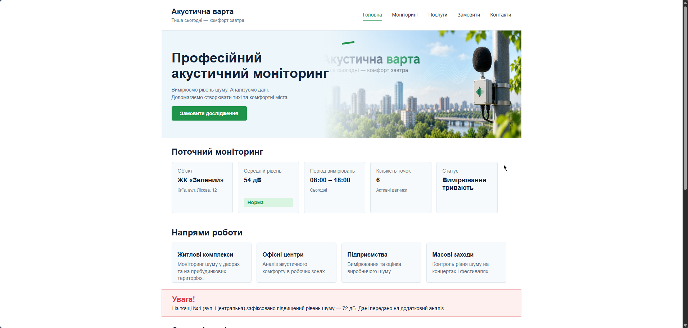
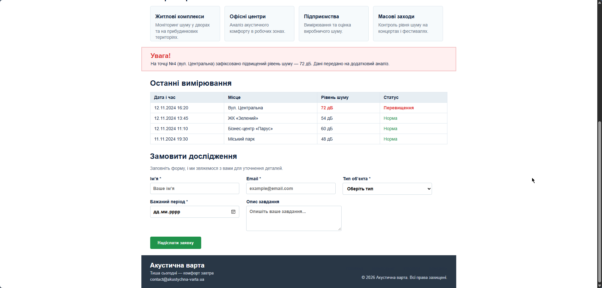

# Звіт до лабораторної роботи №2

## Тема: Верстка сайту компанії згідно з інструкцією (HTML/CSS).

## Мета роботи:

Практично застосувати CSS для оформлення семантичної HTML-структури веб сторінки: підключення зовнішнього CSS, селектори, каскад, specificity, типи блоків і Box Model.

## Виконання роботи

* створено файлову структуру проєкту (`lab-2/index.html`, `css/style.css`, директорію `images/`) та семантичну розмітку вебсайту компанії «Акустична варта» за допомогою тегів `<header>`, `<nav>`, `<main>`, `<section>`, `<article>`, `<aside>` і `<footer>`;
* використано зовнішнє підключення стилів через тег `<link rel="stylesheet">`, застосовано універсальний селектор `*`, селектори тегів, класів, ідентифікаторів (`id`), атрибутів (`input[type="email"]`), а також групування селекторів;
* реалізовано блокову модель Box Model із застосуванням `box-sizing: border-box`, налаштовано геометрію блоків (`width`, `height`, `margin`, `padding`, `border`, `border-radius`), продемонстровано поведінку елементів із `display: block` та `display: inline-block`, а також позиціонування (`position: relative` для блоку попередження та `position: absolute` для бейджа статусу);
* додано стилізацію інтерактивних станів елементів за допомогою псевдокласу `:hover` із плавною анімацією `transition` для кнопок і карток, форму замовлення дослідження, а також тестовий приклад конфлікту CSS-правил для практичного аналізу каскаду та пріоритетності (specificity) через Chrome DevTools.

## Результат

Посилання на опубліковану сторінку:
https://orestforemskyi.github.io/Web-Development-KN-41/lab_2/index.html
---

Скріншот результату:

## Висновок

Під час виконання лабораторної роботи було опановано практичні навички відокремлення структури HTML від візуального оформлення за допомогою зовнішнього CSS-файлу. Закріплено розуміння блокової моделі Box Model, механізмів специфічності та каскадності при вирішенні конфліктів стилів, різниці між блоковими та рядково-блоковими елементами, а також створено чистий інтерфейс без використання сторонніх CSS-фреймворків.