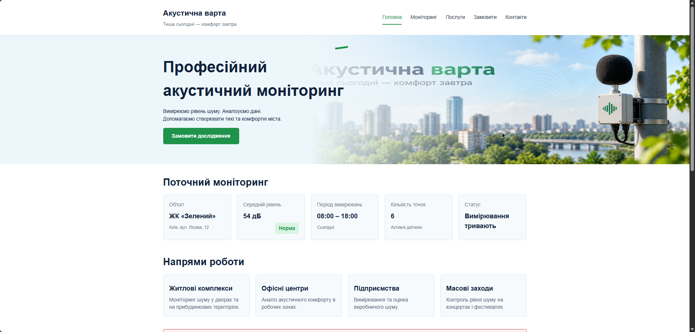
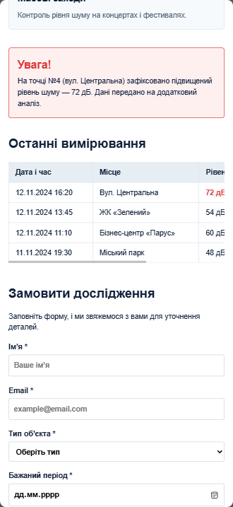
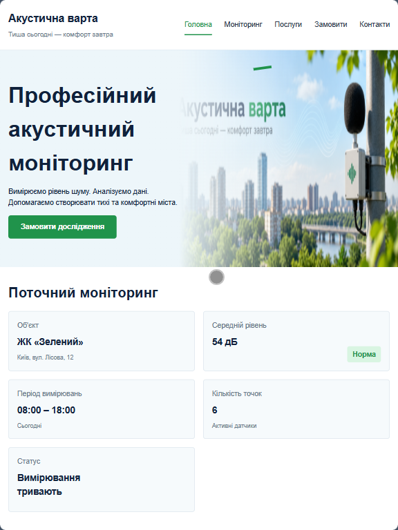
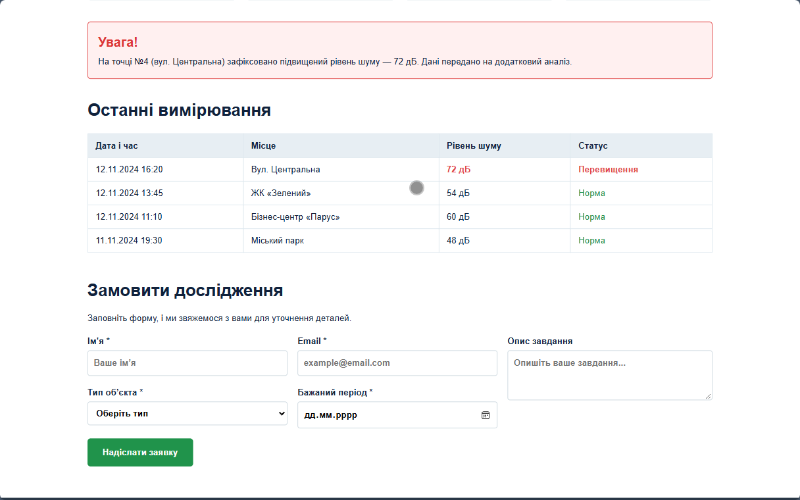

# Звіт до лабораторної роботи №3

## Тема: Адаптивна верстка вебсторінки за допомогою Flexbox, CSS Grid та препроцесора SCSS.

## Мета роботи:
Набути практичних навичок перетворення створеної HTML/CSS-сторінки сайту «Акустична варта» на адаптивний інтерфейс із використанням сучасного препроцесора SCSS, директив `@use`, медіазапитів (Media Queries), технологій Flexbox і CSS Grid; навчитися розробляти інтерфейси за методологією Mobile First та тестувати адаптивність у Chrome DevTools.

## Виконання роботи

* створено модульну структуру Sass-файлів проєкту (часткові файли `_variables.scss`, `_mixins.scss`, `_base.scss`, `_layout.scss`, `_components.scss` та точку входу `main.scss`), скомпільовано стилі у вихідний файл `css/main.css` та налаштовано метатег `viewport`;
* використано препроцесорні можливості SCSS: модульну систему `@use`, змінні для кольорової палітри, відступів і точок перелому (breakpoints), практичні міксини (`respond-to`, `flex-center`, `container`), помірну вкладеність (nesting до 3 рівнів) та функцію `clamp()` для адаптивної типографіки;
* реалізовано двовимірні адаптивні сітки CSS Grid для перебудови блоків моніторингу (1 → 2 → 5 колонок), секції напрямків робіт (1 → 2 → 4 колонки), форми замовлення та hero-секції, а також застосовано Flexbox для компонування навігації в `header`, внутрішніх елементів карток і блоків у `footer`;
* додано адаптивні медіазапити (Media Queries) для станів Mobile (<768px), Tablet (768–1024px) та Desktop (>1024px), контейнер з `overflow-x: auto` для захисту від горизонтального переповнення таблиці, адаптацію форми в один стовпчик на мобільних пристроях і протестовано інтерфейс за допомогою Device Toolbar у DevTools.

## Результат

Посилання на опубліковану сторінку:
https://orestforemskyi.github.io/Web-Development-KN-41/lab_3/index.html
---

Скріншот результату:

## Висновок

Під час виконання лабораторної роботи було опановано перехід від класичного CSS до сучасної модульної архітектури SCSS із використанням змінних, міксинів та директиви `@use`. Закріплено практичні навички ефективного комбінування одновимірних контейнерів Flexbox і двовимірних сіток CSS Grid, реалізації підходу Mobile First та усунення горизонтального переповнення екрана для забезпечення коректного відображення сторінки на різних типах пристроїв.