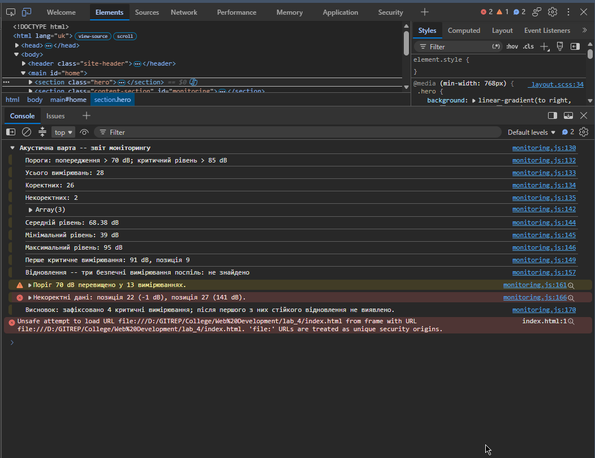

# Звіт до лабораторної роботи №4

## Тема: Робота з циклами, функціями та функціональними виразами в JavaScript.Консоль браузера.

## Мета роботи:

Практично застосувати базові алгоритмічні конструкції мови JavaScript для обробки та аналізу даних: реалізувати цикли різних типів, виконати декомпозицію задачі за допомогою функцій (Declaration, Expression, Arrow) та навчитися діагностувати виконання коду і формувати звіти у Console API браузера.

## Виконання роботи

* створено зовнішній JavaScript-файл `monitoring.js` та успішно підключено його до HTML-документа адаптивного проєкту «Акустична варта» за допомогою тегу `<script>` з атрибутом `defer`;
* використано цикли `for...of` для підрахунку статистики за категоріями, класичний `for` для пошуку першого критичного значення, `do...while` для перевірки першого елемента та `while` для відстеження серії безпечних вимірювань (відновлення);
* реалізовано алгоритми фільтрації та обробки масиву `noiseLevels` із застосуванням операторів `continue` (для пропуску некоректних даних) та `break` (для дострокової зупинки пошуку), а також застосовано три форми функцій: Function Declaration (з підтримкою hoisting), Function Expression та Arrow Function;
* додано автоматичне формування та виведення звітів за допомогою інструментів Console API (`console.log`, `console.group`, `console.table`, `console.warn`, `console.error`) для зручної візуалізації підрахунків, виведення масивів та діагностики помилкових даних.

## Результат

Посилання на опубліковану сторінку:
https://orestforemskyi.github.io/Web-Development-KN-41/lab_4/index.html
---

Скріншот результату:

## Висновок

Під час виконання лабораторної роботи було опановано основи роботи з алгоритмічними конструкціями JavaScript для аналізу масивів даних. Закріплено практичні навички декомпозиції коду через використання функцій різних типів (Declaration, Expression, стрілкові), керування потоком виконання за допомогою циклів (`for`, `while`, `do...while`) та операторів `break` і `continue`, а також ефективного використання Console API для налагодження коду в DevTools.